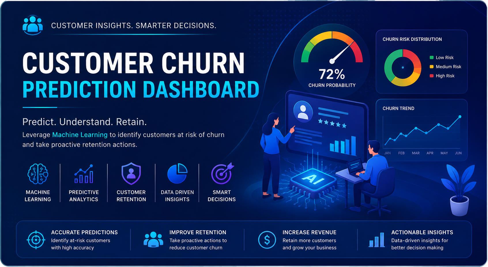
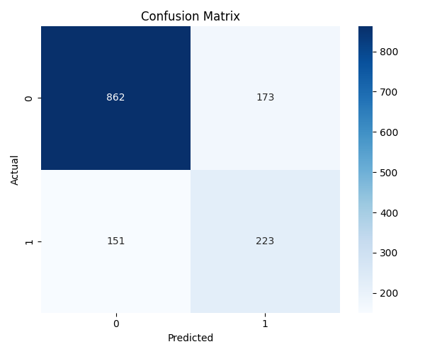
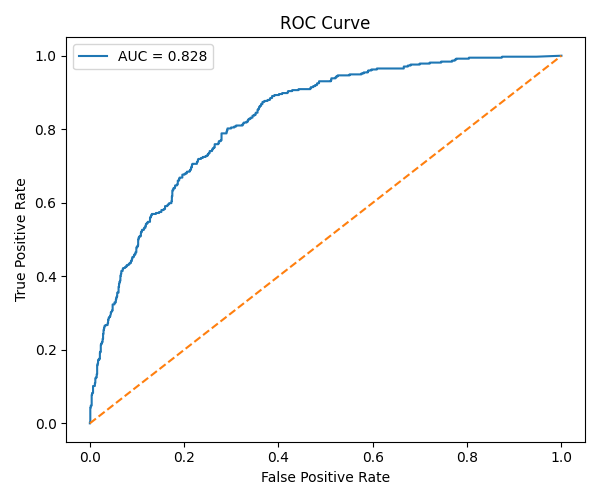
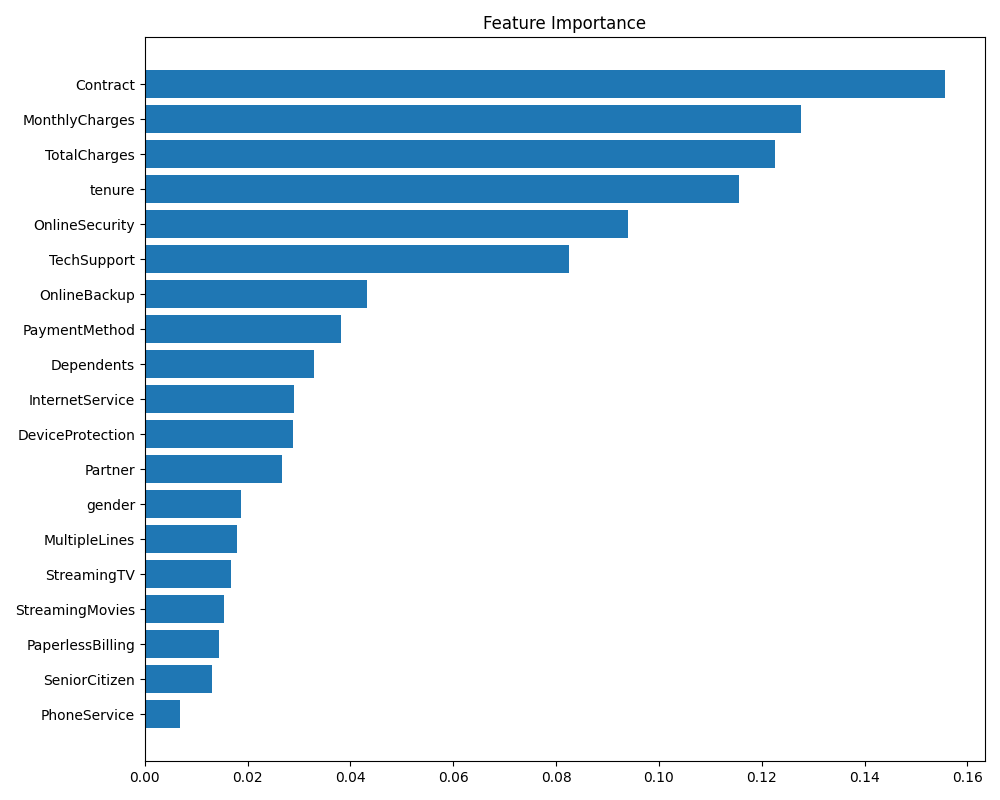

# 📊 Customer Churn Prediction Dashboard

<p align="center">
  
</p>

<p align="center">
  
  
  
  
  
</p>

---

## 📌 Project Overview

Customer churn is one of the biggest challenges faced by telecom companies. This project predicts whether a customer is likely to leave the service using Machine Learning and provides an interactive dashboard built with **Streamlit**.

The project covers the complete machine learning pipeline, from data preprocessing and model training to deployment.

---

## ✨ Features

- 📂 Data Cleaning & Preprocessing
- 🔄 Label Encoding of Categorical Features
- ⚖️ SMOTE for Class Balancing
- 📊 Cross Validation
- 🤖 Model Comparison
  - Logistic Regression
  - Random Forest
  - XGBoost
- 🎯 Hyperparameter Tuning
- 📈 Model Evaluation
- 🖥 Interactive Streamlit Dashboard
- 📥 Download Prediction Report
- 💡 Business Recommendations

---

## 🛠 Tech Stack

| Category | Technologies |
|----------|--------------|
| Language | Python |
| ML Libraries | Scikit-learn, XGBoost |
| Data Processing | Pandas, NumPy |
| Visualization | Matplotlib, Plotly |
| Dashboard | Streamlit |
| Model Storage | Joblib |

---

## 📂 Project Structure

```text
Customer-Churn-Prediction/
│
├── app.py
├── predict.py
├── train_model.py
├── requirements.txt
├── README.md
│
├── dataset/
│
├── images/
│   ├── banner.png
│   ├── dashboard.png
│   ├── confusion_matrix.png
│   ├── roc_curve.png
│   └── feature_importance.png
│
├── model/
│   ├── churn_model.pkl
│   ├── feature_columns.pkl
│   └── label_encoders.pkl
│
├── utils/
│   ├── preprocessing.py
│   ├── model_utils.py
│   └── evaluation.py
│
└── .streamlit/
    └── config.toml
```

---

## ⚙ Machine Learning Workflow

```text
Dataset
   │
   ▼
Data Cleaning
   │
   ▼
Feature Encoding
   │
   ▼
Train/Test Split
   │
   ▼
SMOTE
   │
   ▼
Model Comparison
   │
   ▼
Hyperparameter Tuning
   │
   ▼
Best Model Selection
   │
   ▼
Model Evaluation
   │
   ▼
Deployment with Streamlit
```

---

## 📈 Model Performance

| Metric | Value |
|---------|-------|
| Model | Random Forest |
| Accuracy | 77.86% |
| ROC-AUC | 0.84 |
| Validation | Cross Validation |
| Hyperparameter Tuning | RandomizedSearchCV |

---

## 📷 Dashboard Screenshots

### 🏠 Prediction Dashboard


---

### 📈 Model Evaluation







---

## 🚀 Installation

Clone the repository

```bash
git clone https://github.com/YOUR_USERNAME/Customer-Churn-Prediction.git
```

Move into the project directory

```bash
cd Customer-Churn-Prediction
```

Install dependencies

```bash
pip install -r requirements.txt
```

Run the Streamlit application

```bash
streamlit run app.py
```

---

## 📊 Dataset

Dataset used:

**Telco Customer Churn Dataset**

The dataset contains customer demographics, account information, subscribed services, and churn labels.

---

## 💻 Future Improvements

- Deep Learning Model
- SHAP Explainability
- Prediction History
- Docker Deployment
- CI/CD Pipeline
- REST API using FastAPI

---

## 👨‍💻 Author

**Rishabh**

Machine Learning & AI Enthusiast

GitHub: https://github.com/YOUR_USERNAME

LinkedIn: https://linkedin.com/in/YOUR_LINKEDIN

---

## ⭐ Support

If you found this project helpful, consider giving it a ⭐ on GitHub!
